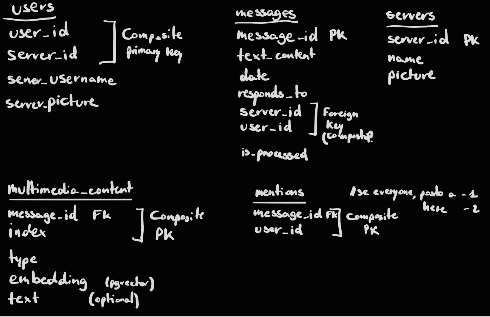

# Discord Social Network Analysis & AI Suite

A high-performance research project designed to analyze Social Network dynamics,
Natural Language patterns, and Computer Vision contexts within Discord
communities. This project is not just a bot, but a full-stack application
leveraging AI to understand community drift, linguistic convergence, and
stylistic imitation.

## Research Areas

  - **Social Network Analysis (SNA)**: Temporal network drift, community detection,
    and centrality mapping (identifying "bridge" users and core hubs).
  - **Natural Language Processing (NLP)**: Linguistic convergence over time,
    inside-joke identification, and communicative style imitation via Fine-tuned
    LLMs.
  - **Computer Vision (CV)**: Multimodal context enrichment by analyzing images,
    GIFs, and shared links using CLIP-based embeddings.

## Infrastructure & Hardware Setup

The project is built on a high-performance local stack, optimized for
GPU-accelerated workloads.

Current Progress: Environment Fully Configured

  - **OS/Environment**: Windows 11 + WSL2 (Ubuntu 24.04 LTS).
  - **Orchestration**: Docker Compose with NVIDIA Container Toolkit integration.
  - **GPU Acceleration**: Hardware-passthrough for NVIDIA RTX 2070 Super (8GB VRAM).
  - **Drivers**: NVIDIA Game Ready Drivers (v596.49+) supporting CUDA 13.2.

## PostgreSQL Database Design (4NF)
The relational schema is normalized to the Fourth Normal Form (4NF) to ensure data integrity and scalability in a multi-tenant environment.

**Key Features:**
- **Multi-Tenancy:** Composite Primary Keys (`user_id`, `server_id`) allow for server-specific user profiles (nicknames/avatars).
- **SNA Ready:** A dedicated `mentions` table handles 1-to-1 relationships, with special handling for global mentions (`everyone` as `-1`, `here` as `-2`).
- **Vector Search:** `multimedia_content` will likely use the **pgvector** extension to store and query high-dimensional CLIP embeddings without storing raw files on disk.
- **Processing Pipeline:** An `is_processed` flag in the `messages` table manages the incremental batch analysis for the AI engine.

## GPU Passthrough Verification

The environment successfully communicates between the Windows Host, WSL2, and
isolated Docker containers. Verified via:

docker run --rm --gpus all nvidia/cuda:13.2.0-base-ubuntu22.04 nvidia-smi

Status: Confirmed. GPU Utility and Memory mapping are fully operational within
the containerized environment.

## Tech Stack

  - **Backend**: Python 3.12 + FastAPI.
  - **Databases**:
      - **PostgreSQL 18**: Structured data, user consent management, and raw message logs.
      - **Neo4j 5**: Graph database for Social Network Analysis and relationship mapping.
  - **Frontend**: Vue.js 3 + TailwindCSS (Data visualization and "Spotify Wrapped" style personal analytics).
  - **AI/ML**: PyTorch, CLIP (Multimodal), and Unsloth/LoRA for efficient LLM Fine-tuning on local hardware (most likely, still in need to be precisely defined).

## Project Structure

SocialNetworkAnalysisBot/                                                                                                                                               
├── compose.yaml           # Docker orchestration (DBs, API, Bot, AI)                                                                                                                                                     
├── .env                   # Environment variables & Secrets (Git-ignored)                                                                                                                                           
├── .dockerignore          # Excludes local files from Docker builds                                                                                                                                                   
├── backend/               # FastAPI application logic                                                                                                                                                             
├── bot/                   # Discord gateway hook & event listeners                                                                                                                                             
├── analysis/              # Batch processing & AI engine (GPU-dependent)                                                                                                                                  
├── frontend/              # Vue.js dashboard for SNA visualization                                                                                                                                     
└── data/                  # Persistent storage for SQL data                                                                                                                                                

## Privacy & Ethics (GDPR Compliance)

This project will implement Privacy by Design:

1.  **Strict Consent**: No data is collected or processed for users who do not explicitly opt-in via the /consent command.
2.  **Right to be Forgotten**: Users can invoke the /obliterate command to perform a CASCADE DELETE of all their data across SQL and Graph databases.
3.  **Local Processing**: All data is stored and processed locally on the owner's hardware; no data is sold or transmitted to 3rd party AI providers.
4.  **Full ID Anonymization**: Every Discord ID is salted and hashed (SHA-256) before entering the database. This ensures that no real Discord IDs are ever stored, providing a layer of protection even in the event of a data breach.

Initial tests of the code will be perfomed on users' messages who have explicitly given consent.

## How to Run (Development)

1.  Clone the repo inside your WSL2 home directory (for optimal I/O
    performance).
2.  Configure Secrets: Create a .env file based on .env.example.
3.  Launch Databases:
    docker compose up -d db_sql db_graph
4.  Development Local Environments:
        For the backend:
            cd backend
            python3 -m venv venv && source venv/bin/activate
            pip install -r requirements.txt
            uvicorn main:app --reload
        For the discord bot:
            cd ../bot
            python3 -m venv venv && source venv/bin/activate
            pip install -r requirements.txt
            python bot.py
        For the AI Analysis Engine:
            cd ../analysis
            python3 -m venv venv && source venv/bin/activate
            pip install -r requirements.txt

If you want to run the entire suite as a standalone containerized system:
    docker compose up --build

## Roadmap

- [x] Infrastructure setup (WSL2, Docker, CUDA Passthrough)
- [x] Database Schema design (PostgreSQL)
- [ ] API Development (FastAPI)
- [ ] Discord Bot Gateway & Consent Management
- [ ] Database Schema design (Neo4j)
- [ ] Batch Analysis Engine (NLP/CV Integration)
- [ ] LLM Fine-tuning for Style Imitation

Date: May 2026
Author: [Nichole A.]
